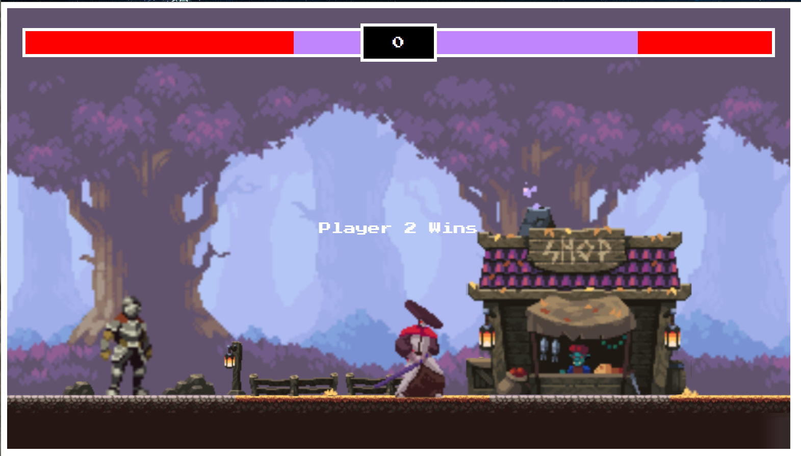

# Fighting-Game
This is my first attempt at making a game using html and javascript. This is a very basic pixelated mortal kombat style game. Unfortunately I am not at the level of making an AI to play against yet, so for now you will have to find a friend or play against yourself. There is a dynamic health bar, a timer, and player movement.  I never thought making a game like this was possible using just javascript and html, but thankfully I found an amazing tutorial on Youtube, which I will credit farther down.

## Features
- Dynamic Health Bar on Top
- Timer Countdown on Top in the middle
- Semi custom background with an animated shop sprite
- Fully animated sprites for each character
- Independent movement controls for each character
- Hit detection for each character
- Simulated gravity
- Winner Detection

## Bugs
- Currently both characters are facing the same direction, leading to unbalanced fights
- Characters face same way no matter which direction they are going, so you can only attack in the direction you are facing.
- No jump height limit
- No border limit to prevent players from leaving the fight zone

## Usage
- Player 1 Controls
    - W: Jump
    - A: Run Left
    - D: Run Right
    - Space: Attack

- Player 2 Controls
    - Up Arrow: Jump
    - Left Arrow: Run Left
    - Right Arrow: Run Right
    - Down Arrow: Attack

- Health Bar
    - Each Players Health is displayed in light purple
    - When you take damage, the health you have lost is displayed in red.

- If the timer runs out before a player runs out of health the player with the most health is the winner.
- To restart the fight just refresh the page.

## Future Development Ideas
I may refactor the whole concept of the game from fighting each other to making it a co-op game, where they can fight the same enemy's and go to different levels. Also will need to fix the bugs listed above. I want to introduce different types of attacks that have varying speeds and damage dealt.

## Credits
While I did write the code and made a few minor tweaks, I would not have been able to do this without Chris Courses on Youtube.
Here is a link to the tutorial: https://youtu.be/vyqbNFMDRGQ

## License
MIT

## Deployed Site
- https://samuraivsknight.netlify.app/

## Screenshots
The following image shows the applications appearance at the end of a game:

## Questions

<b>Cameron Whritenour</b> -  
[Github](www.github.com/camwhritenour)  
whritenourc@outlook.com

